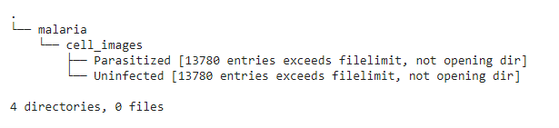

TABLE OF CONTENT
---------------------

 * Introduction
 * Requirements
 * Preparing Dataset
 * Screenshots
 * Tech/Framework Used
 * Features
 * Usage
 * Credits
# Introduction

In this project, I am building a model that will learn to automatically analyze medical images for malaria testing.

## Requirements

First of all, you need to download the image dataset using link ftp://lhcftp.nlm.nih.gov/Open-Access-Datasets/Malaria/cell_images.zip or go to [official NIH page](https://lhncbc.nlm.nih.gov/publication/pub9932) and download cell_images.zip file. After downloading extract the downloaded item. Make a new folder ```malaria``` and move the extracted folder in that folder.

Project directory should look like this-



## Preparing Dataset

## Screenshots

## Tech/Framework Used

## Features

## Usage

## Credits
