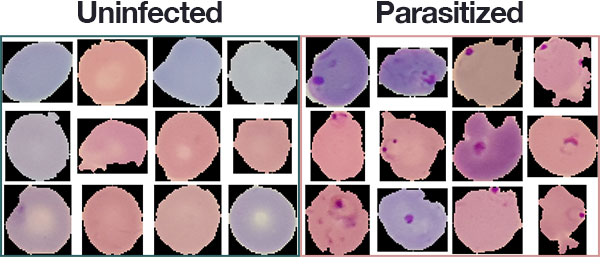
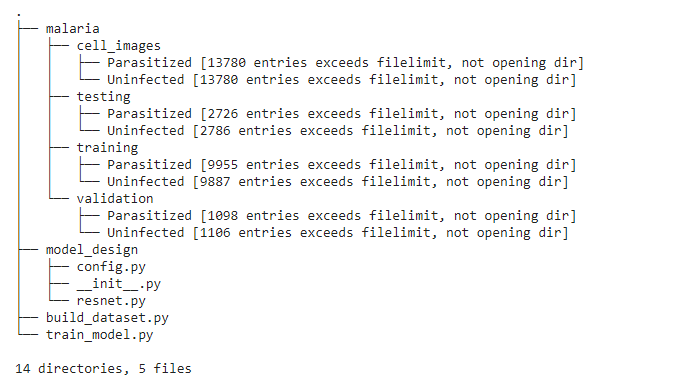
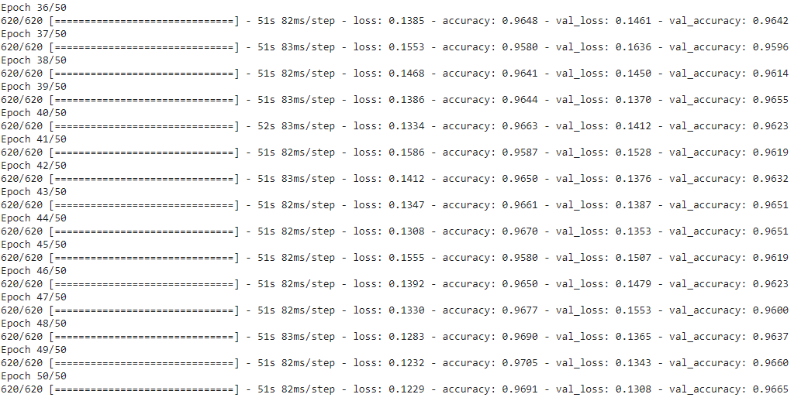
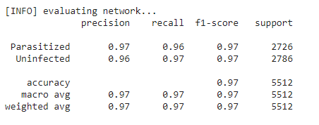
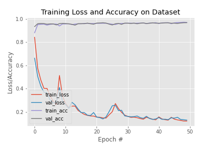

TABLE OF CONTENT
---------------------

 * Introduction
 * Requirements
 * Preparing Dataset
 * Tech/Framework Used
 * Features
 * Credits
# Introduction

In this project, I am building a model that will learn to automatically analyze medical images for malaria testing.

## Requirements

First of all, you need to download the image dataset using link ftp://lhcftp.nlm.nih.gov/Open-Access-Datasets/Malaria/cell_images.zip or go to [official NIH page](https://lhncbc.nlm.nih.gov/publication/pub9932) and download cell_images.zip file. After downloading extract the downloaded item. Make a new folder ```malaria``` and move the extracted folder in that folder.

Project directory should look like this-


Image dataset look like this-



## Preparing Dataset

Since our dataset doesn't have pre split data for training, testing and validation, so we need to do it ourselvers.
To create our data split we are going to use ```build_dataset.py``` script.
  - Grab the paths to all our example images and randomly shuffle them.
  - Split the images paths into the training, validation, and testing.
  - Create three new sub-directories in the ```malaria/``` directory, namely ```training/``` , ```validation/``` , and ```testing/```.
  - Automatically copy the images into their corresponding directories.

After executing ```build_dataset.py``` project directory will lool similar to this-


## Tech/Framework Used
 - Tensorflow
 - Keras
 - Google Colab(If you don't have GPU then you can use Colab Notebook)

## Result/Performance

I got accuracy of ```96.91%``` on training data and ```96.65%``` on validation data after running model for 50 epochs.



Performance Matrix




 
## Features

The model was trained for a total of 50 epochs.

Each epoch takes approx 52s on Goggle Colab GPU enabled notebook.
Overall, the entire training process only took approx 45 minutes which is pretty good because we are getting almost 97% accuracy at end of 50th epoch.

There are a number of benefits to using the ResNet-based model we trained here today for medical image analysis.

 - Our model is a complete end-to-end malaria classification system.
 - Unlike NIH’s approach which leverages a multiple step process of (1.) feature extraction from multiple models and (2.) classification, we instead can utilize only a single, compact model and obtain comparable results.
 - Our final model is only 17.5 MB which is very handy.
 - Our model took only 45 minutes to train while NIH’s model took ~24 hours.
 - Our model is faster in terms of both (1.) forward-pass inference time and (2.) significantly fewer parameters and memory/hardware requirements.
 - Our model requires only 64×64 input images and obtains near identical accuracy.

## Credits

 - [ResNet official publication](https://arxiv.org/abs/1512.03385)
 - [PyImageSearch](https://www.pyimagesearch.com/)
